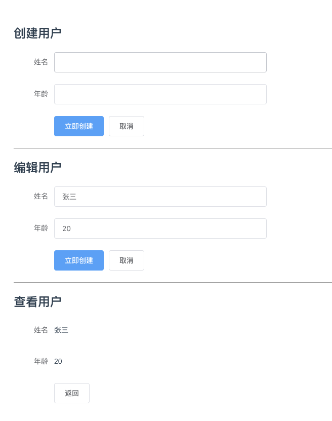

<!--
 * @Description: 
 * @Author: 李大玄
 * @Date: 2021-11-30 17:33:25
 * @FilePath: /admin-website-vue2/src/views/blog/demo/extend.md
-->
Example

产品提了一个需求，在系统中添加一个用户功能模块，需要实现添加、修改、查看功能

从设计图中看到的 ui 情况是创建与修改界面完全相同，区别在于修改时有表单中有默认的数据, 查看

与编辑页面布局上差不多，区别是只读，没有保存按钮

目录结构
```
user
	|- common.vue
  |- create.js
  |- edit.js
  |- check.vue
```

创建用户

把创建与编辑的公共部分写到一个父类中，在父类中定义好两边都需要的方法或者属性

common.vue
```js
<template>
  <div style="width: 500px;">
    <el-form ref="form" :model="form" label-width="80px">
      <el-form-item label="姓名">
        <el-input v-model="form.name"></el-input>
      </el-form-item>

      <el-form-item label="年龄">
        <el-input v-model="form.age"></el-input>
      </el-form-item>

      <el-form-item>
        <el-button type="primary" @click="onSubmit">立即创建</el-button>
        <el-button @click="onCancel">取消</el-button>
      </el-form-item>
    </el-form>
  </div>
</template>

<script>
/**
 * @description 创建与编辑的公共逻辑
 */
export default  {
  data () {
    return {
      form: {
        name: '',
        age: ''
      }
    }
  },
  methods: {
    // 保存
    onSubmit() {
    },
    // 取消
    onCancel() {
    }
  }
}
</script>
```

create.js


```html
/**
 * @file 创建用户
 * @author 李大玄
 */

// 引入基础模块
// import Common from './common'

export default  {
  name: 'CreateUser',
  // 继承
  extends: Common,
  methods: {
    // 重写保存方法
    onSubmit() {
      // 在此处开发创建用户的业务逻辑
      console.log(this.$data.form)
    }
  }
}
```
编辑用户

编辑与创建很相似，代码也比较雷同，区别在于加载组件时需要从API中获取用户详情数据, 保存时与调用编辑用户API 接口

edit.js
```js
/**
 * @file 编辑用户
 * @author 李大玄
 */

// 引入基础模块
// import Common from './common'

export default {
  name: 'EditUser',
  // 继承
  extends: Common,
  created() {
    this.getUserDetails();
  },
  methods: {
    /** 获取用户详情数据 */
    async getUserDetails() {
      const user = {
        name: '张三',
        age: 20
      }
      setTimeout(() => {
        this.$data.form = user;
      });
    },
    // 重写保存方法
    onSubmit() {
      // 在此处开发编辑用户的业务逻辑
    }
  }
}
```
查看用户

上面介绍过，查看用户与编辑用户的功能有重合的部分，从用户角度分析区别是 ui 的布局, 这里我们在开发是则不在继承 common 模块，继承 edit 模块，重写 ui 部分
check.vue
```html
<template>
  <div style="width: 500px;">
    <el-form ref="form" :model="form" label-width="80px">
      <el-form-item label="姓名">
        <span>{ { form.name } }</span>
      </el-form-item>
      
      <el-form-item label="年龄">
        <span>{ { form.age } }</span>
      </el-form-item>
      
      <el-form-item>
        <el-button @click="onCancel">返回</el-button>
      </el-form-item>
    </el-form>
  </div>
</template>

<script>
// import EditUser from './edit';
export default {
  name: 'CheckUser',
  // 继承
  extends: EditUser,
}
</script>

```