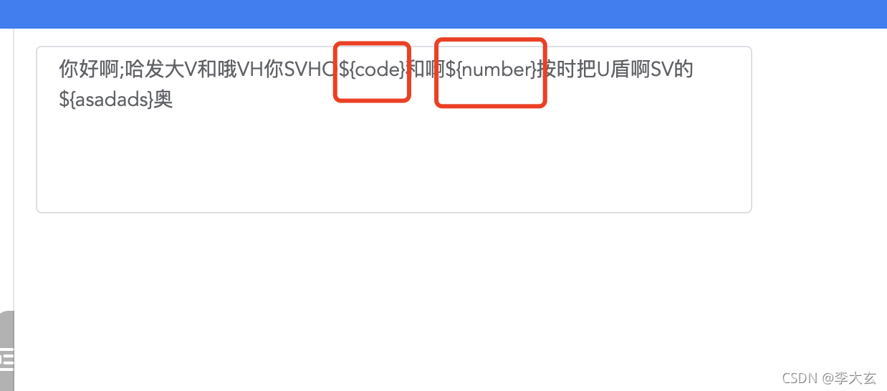

## 我就这么坐着生活给我什么我就接着拿走什么我就看着。

我的github: [李大玄](https://github.com/lidaxuan)
我的私人博客: [李大玄](https://webldx.github.io)
我的npm开源库: [李大玄](https://www.npmjs.com/~lijixuan)  
我的简书: [李大玄](https://www.jianshu.com/u/a8edf13c0df4)
我的CSDN: [李大玄](https://blog.csdn.net/weixin_43553701)
我的掘金: [李大玄](https://juejin.im/user/3236571137979256)
哔哩哔哩: [李大玄](https://space.bilibili.com/441278759/video)
语雀文档: [李大玄](https://www.yuque.com/lijixuan/kb/cvtat5)
**圈红地方不可删除, 功能已实现**


```html
<!--
 * @Description: 
 * @Author: 李大玄
 * @Date: 2021-08-04 15:26:14
 * @FilePath: /ucenter-messageflat-web-view/src/pages/test/ipt.vue
-->
<template>
  <el-input
    type="textarea"
    placeholder="请输入模板内容"
    class="w500"
    rows="5"
    resize="none"
    v-model="val"
    @keydown.delete="onDeleteKeyDown"
    maxlength="500"
    show-word-limit
    id="textarea"
  ></el-input>
  <!-- <pre>{{config}}</pre> -->
</template>

<script>
import { reactive, toRefs } from 'vue';
// import {config} from './map.ts'
export default {
  name: 'custom-textarea',
  props: {
    value: {
      required: true,
      type: [Number, String],
    },
    protectedSelection: {
      type: String,
      default: '0,0', // 'Start,End'
    },
  },
  setup() {
    const state = reactive({
      val: '你好啊;哈发大V和哦VH你SVHO${code}和啊${number}按时把U盾啊SV的${asadads}奥',
      list: [
        { type: 1, desc: '验证码', code: '${code}' },
        { type: 2, desc: '电话号码', code: '${phone}' },
        { type: 3, desc: '其它号码（订单号、密码等）', code: '${number}' },
        { type: 4, desc: '时间', code: '${datetime}' },
        { type: 5, desc: '金额', code: '${amount}' },
        { type: 6, desc: '其它（名称、账号、地址等）', code: '${other}' },
      ],
      findIndexArr: [],
      // config: config
    });


    const onDeleteKeyDown = (e) => {
      state.findIndexArr = [];
      const { target } = e;
      // console.log(`deleteKeyDown:
      //   selectionStart: ${target.selectionStart}
      //   selectionStart: ${target.selectionEnd}
      //   length: ${target.value.length}
      //   value: ${target.value}
      //   keyCode: ${e.which}
      // `);
      // 如果包含不能删除的区域，禁止
      for (let i = 0, list = state.list; i < list.length; i++) {
        const findIndex = state.val.indexOf(list[i].code);
        if (findIndex != -1) {
          state.findIndexArr.push([findIndex, findIndex + list[i].code.length]);
        }
      }
      if (isContainsProtectedSelection(target.selectionStart)) {
        e.preventDefault();
      }
    };
    const isContainsProtectedSelection = (start) => {
      // 第二个或条件这里其实没必要，因为假设不能删除的字符串就在开头
      // 如果字符串位置不固定，那么是需要的，且 props 的 protectedSelection 也需要动态计算
      for (let i = 0; i < state.findIndexArr.length; i++) {
        if (start > state.findIndexArr[i][0] && start <= state.findIndexArr[i][1]) {
          // 删除范围在区间
          return true;
        }
      }
      return false;
    };
    return {
      ...toRefs(state),
      onDeleteKeyDown,
    };
  },
};
</script>

<style scoped>
</style>
```